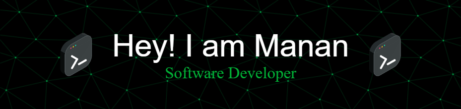

<a href="https://git.io/typing-svg">
  

</a>
 

🙍🏽‍♂️ Hello there, I'm Manan Laddha, a third-year student studying computer science. I have expertise in Python and Java software development and a strong interest in Cybersecurity. I'm well-versed in data structures and always eager to learn new things. I enjoy being a part of a collaborative team, and I'm known for my quick learning abilities, coding skills, and effective communication. You can find my projects on GitHub. Besides programming, I also like to explore and tinker with Linux.
 
 

# 💻 Tech Stack:

|               |           |
|       ---     |    ---    |
| `Languages`   |     |
| `Libraries`   |       |
| `Web-Dev`     |    |
| `Hosting`     |    |
| `Tools`       |    
| `Desgining`       | 

### Connect With Me 🌐

# 📊 GitHub Stats:
 

### ✍️ Random Dev Quote
&nbsp;&nbsp;&nbsp;&nbsp;&nbsp;&nbsp;&nbsp;&nbsp;&nbsp;&nbsp;&nbsp;&nbsp;&nbsp;&nbsp;&nbsp;&nbsp;&nbsp;&nbsp;&nbsp;&nbsp;&nbsp;&nbsp;&nbsp;&nbsp;&nbsp;&nbsp;&nbsp;&nbsp;&nbsp;&nbsp;

---
